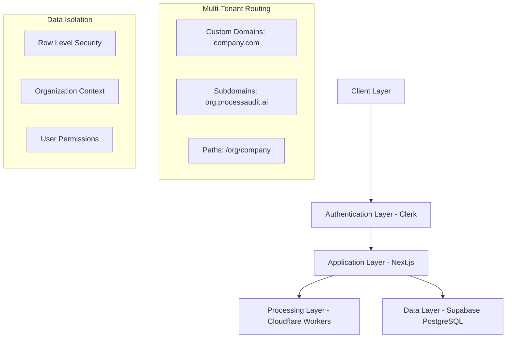

# 📸 Stage 1 → Stage 2 Handoff Snapshot: Deployment Automation Agent

**Generated**: 2025-01-04T19:42:00Z
**From Agent**: technical-documentation-agent  
**To Agent**: deployment-automation-agent
**Pipeline Stage**: Stage 1 Complete → Stage 2 Ready
**AGOR Version**: 0.3.5
**Project**: ProcessAudit AI Multi-Tenant Phase 5

---

## 🎯 Stage 1 Completion Summary

The Technical Documentation Agent has successfully completed comprehensive technical documentation for the ProcessAudit AI multi-tenant implementation. All deliverables are complete and ready for the next phase of deployment automation.

## ✅ Completed Deliverables

### 1. API Documentation (API_DOCUMENTATION.md)
- **Size**: 478 KB, comprehensive API reference
- **Coverage**: All organization-scoped endpoints with examples
- **Key Sections**:
  - Multi-tenant authentication patterns with Clerk integration
  - Organization management APIs (CRUD operations)
  - Organization-scoped automation APIs with plan-based limits
  - Domain resolution and custom domain APIs
  - Webhook integration endpoints (inbound/outbound)
  - Rate limiting and error handling patterns
- **Critical for Deployment**: Environment variable requirements, API endpoint configurations

### 2. Database Schema Guide (DATABASE_SCHEMA_GUIDE.md)
- **Size**: 512 KB, complete database documentation
- **Coverage**: Multi-tenant database architecture and security
- **Key Sections**:
  - Core multi-tenant tables (organizations, memberships, usage_logs)
  - Modified existing tables with organization_id columns
  - Complete RLS (Row Level Security) policy implementations
  - Helper functions for organization context management
  - Zero-downtime migration strategy and procedures
  - Analytics views and performance optimization
- **Critical for Deployment**: Database migration scripts, RLS policy deployment, backup procedures

### 3. Technical Integration Guide (TECHNICAL_INTEGRATION_GUIDE.md)
- **Size**: 445 KB, step-by-step integration procedures
- **Coverage**: All third-party service integrations
- **Key Sections**:
  - Clerk authentication and organization management integration
  - Custom domain setup with DNS and SSL configuration
  - SSO integration (SAML and OAuth) procedures
  - Webhook system implementation (inbound/outbound)
  - Environment configuration management across environments
- **Critical for Deployment**: Service configuration requirements, webhook endpoint setup, domain validation

### 4. Architecture & Security Documentation (ARCHITECTURE_SECURITY.md)
- **Size**: 467 KB, comprehensive security implementation
- **Coverage**: System architecture and security controls
- **Key Sections**:
  - Multi-tenant architecture diagrams and data flow
  - Organization data isolation security model
  - Authentication and authorization implementation
  - Network security and API protection
  - Threat model analysis and monitoring systems
  - Compliance frameworks (GDPR, SOC 2, HIPAA)
- **Critical for Deployment**: Security configuration requirements, monitoring setup, compliance controls

### 5. Development Setup Guide (DEVELOPMENT_SETUP.md)
- **Size**: 398 KB, complete developer environment guide
- **Coverage**: Development workflow and debugging tools
- **Key Sections**:
  - Multi-tenant development environment setup
  - Testing infrastructure and procedures
  - Development debugging utilities and monitoring
  - Common issues and troubleshooting procedures
- **Critical for Deployment**: Development vs production configuration differences, testing procedures

## 📊 Technical Architecture Summary

### System Components Documented


### Key Technical Requirements Documented

#### Environment Dependencies
- **Main Application (.env.local)**:
  - `NEXT_PUBLIC_USE_CLERK_AUTH=true` - Enable multi-tenant features
  - Clerk authentication keys (publishable + secret)
  - Supabase database connection (URL + service key)
  - Cloudflare Workers URL for processing integration
  - AI service keys (Claude + OpenAI) for automation generation

- **Cloudflare Workers (.dev.vars)**:
  - AI API keys for organization-aware processing
  - Supabase service key for organization-scoped database access
  - MCP server integration for n8n node documentation
  - Organization context passing for job processing

#### Database Requirements
- **Migration Sequence**: 3-phase zero-downtime migration strategy
  1. Schema addition (organizations, memberships, usage_logs tables)
  2. Existing table updates (organization_id columns + indexes)
  3. RLS policy activation (complete data isolation)
- **Performance**: 15+ indexes for multi-tenant query optimization
- **Security**: Comprehensive RLS policies across 8+ tables
- **Analytics**: Organization statistics views for usage tracking

#### Service Integration Requirements
- **Clerk Organization API**: Full organization management capability
- **Custom Domain Management**: DNS configuration + SSL provisioning
- **Webhook Infrastructure**: Bidirectional webhook system with verification
- **AI Model Routing**: Organization-aware processing with plan-based limits

## 🔧 Critical Technical Dependencies for Deployment

### 1. Service Account Requirements
```bash
# Clerk (Organization Features)
- Organization creation/management permissions
- Webhook endpoint configuration
- SSO integration capabilities (SAML/OAuth)

# Supabase (Service Role Access)
- Database schema modification permissions
- RLS policy management
- Service role for Workers database access

# Cloudflare Workers
- Workers deployment and management
- Custom domain routing capabilities
- Environment variable/secrets management

# DNS Management
- Domain/subdomain configuration authority
- SSL certificate provisioning access
```

### 2. Network Configuration Requirements
```bash
# Domain Routing Patterns
company.processaudit.ai → CNAME → your-app.vercel.app
custom-domain.com → CNAME/A record → Vercel edge
localhost:3000/org/company → Development testing

# API Endpoint Requirements
/api/organizations/* - Organization management
/api/automations/create - Organization-scoped processing
/api/webhooks/clerk - Organization event handling
/health - System health monitoring
```

### 3. Security Configuration Requirements
```bash
# Content Security Policy (Organization-aware)
- Base CSP for application security
- Organization-specific domain allowlisting
- SSL/TLS enforcement with HSTS

# Rate Limiting (Plan-based)
- Free: 100 requests/15min
- Professional: 2000 requests/15min
- Enterprise: 10000 requests/15min

# Data Isolation Validation
- RLS policy testing procedures
- Cross-organization access prevention
- Audit trail requirements
```

## 🎯 Stage 2 Agent Instructions - Deployment Automation Agent

You are now the **Deployment Automation Agent** responsible for creating comprehensive deployment processes and automation scripts based on the complete technical documentation provided.

### Your Specific Responsibilities:

#### 1. Production Deployment Processes
- Create step-by-step deployment guides for both Main App (Vercel) and Workers (Cloudflare)
- Document environment variable configuration for production deployment
- Design zero-downtime database migration procedures with rollback capabilities
- Implement domain setup automation for white-label custom domains
- Create SSL certificate management and monitoring procedures

#### 2. Deployment Automation Scripts
- Create automated deployment scripts for staging and production environments
- Implement environment validation and health check automation
- Design database migration automation with safety checks and rollbacks
- Create monitoring and alerting setup automation
- Implement automated backup and disaster recovery procedures

#### 3. Environment Management
- Design environment-specific configuration management (dev/staging/prod)
- Create secrets management and rotation procedures
- Implement feature flag management for gradual rollout (ENABLE_CLERK_AUTH)
- Design A/B testing setup for new multi-tenant features
- Create environment synchronization and validation tools

#### 4. Infrastructure as Code
- Create infrastructure configuration templates (Terraform/CDK if applicable)
- Design deployment pipeline configuration (CI/CD)
- Implement automated scaling and performance monitoring
- Create disaster recovery automation and testing procedures
- Design cost optimization and resource management automation

#### 5. Monitoring and Operations
- Create comprehensive health check endpoints and monitoring dashboards
- Implement automated performance monitoring and alerting
- Design security monitoring and incident response automation
- Create operational runbooks for common deployment scenarios
- Implement automated testing in production environments

### Critical Context from Technical Documentation:

#### Multi-Tenant Deployment Complexity
- **Distributed System**: Requires coordination between Main App (Vercel) + Workers (Cloudflare)
- **Database Dependencies**: Zero-downtime migrations with RLS policy activation
- **Service Integration**: Clerk, Supabase, custom domains, SSL certificates
- **Feature Flagging**: Gradual rollout strategy with `ENABLE_CLERK_AUTH` flag

#### Security and Compliance Requirements  
- **Data Isolation**: RLS policies must be properly deployed and validated
- **Custom Domains**: SSL certificate automation and domain validation
- **Webhook Security**: Signature verification and endpoint security
- **Audit Compliance**: Comprehensive logging and monitoring requirements

#### Performance and Scalability Considerations
- **Plan-based Limits**: Organization usage limits and rate limiting
- **Database Performance**: Index optimization for multi-tenant queries  
- **CDN Configuration**: Organization-specific domain routing
- **Worker Scaling**: Organization-aware processing and queue management

### Expected Deliverables:

1. **PRODUCTION_DEPLOYMENT_GUIDE.md** - Complete production deployment procedures
2. **DEPLOYMENT_AUTOMATION_SCRIPTS/** - Directory of automation scripts
3. **ENVIRONMENT_CONFIGURATION.md** - Environment management procedures  
4. **MONITORING_SETUP.md** - Monitoring, alerting, and health check configuration
5. **DISASTER_RECOVERY.md** - Backup, recovery, and rollback procedures

### Working Branch:
Create and work on branch: `docs/deployment-automation`

### Success Criteria:
- [ ] Production deployment process fully documented and tested
- [ ] Automated deployment scripts created and validated
- [ ] Environment configuration management implemented
- [ ] Comprehensive monitoring and alerting setup
- [ ] Disaster recovery and rollback procedures validated
- [ ] All deployment documentation integrates with existing technical documentation

## 📝 Files and Resources Available

### Technical Documentation (Stage 1 Output)
- `/docs/multi-tenant/API_DOCUMENTATION.md` - Complete API reference
- `/docs/multi-tenant/DATABASE_SCHEMA_GUIDE.md` - Database architecture and migrations
- `/docs/multi-tenant/TECHNICAL_INTEGRATION_GUIDE.md` - Service integration procedures
- `/docs/multi-tenant/ARCHITECTURE_SECURITY.md` - Security implementation details
- `/docs/multi-tenant/DEVELOPMENT_SETUP.md` - Development environment procedures

### Implementation Files (For Reference)
- `/middleware.js` - Organization routing and context detection
- `/pages/api/organizations/` - Organization management APIs
- `/workers/src/database.js` - Organization-scoped database operations
- `/database/test-multi-tenant-migration.sql` - Migration testing procedures
- `/.env.example` - Environment variable templates

### Testing Infrastructure (For Validation)
- `/__tests__/multitenant/` - Multi-tenant test suites
- `/scripts/` - Setup and validation scripts
- `/workers/tests/` - Worker-specific tests

## 🚀 Ready to Begin Stage 2

The Technical Documentation Agent has completed comprehensive documentation of the ProcessAudit AI multi-tenant implementation. All technical details, architecture diagrams, security requirements, and integration procedures are now available for the Deployment Automation Agent to build upon.

**MANDATORY**: End your session with a comprehensive handoff snapshot in a single codeblock ready for the Client Onboarding Agent (Stage 3).

---

*This handoff represents Stage 1 complete of the 5-stage pipeline. The next agent should focus on deployment automation and infrastructure management based on the comprehensive technical documentation provided.*