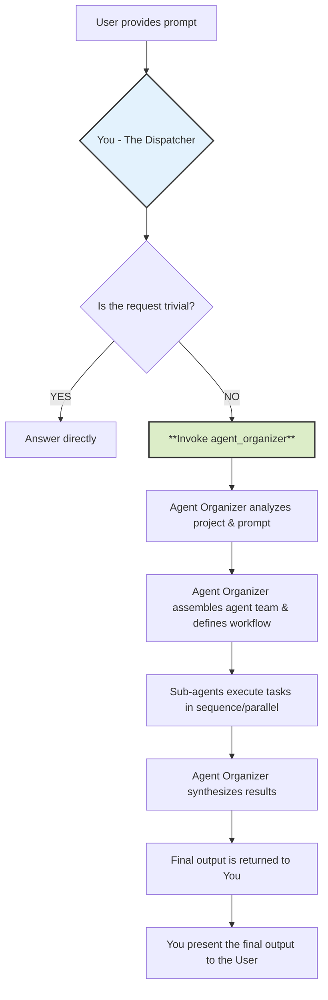
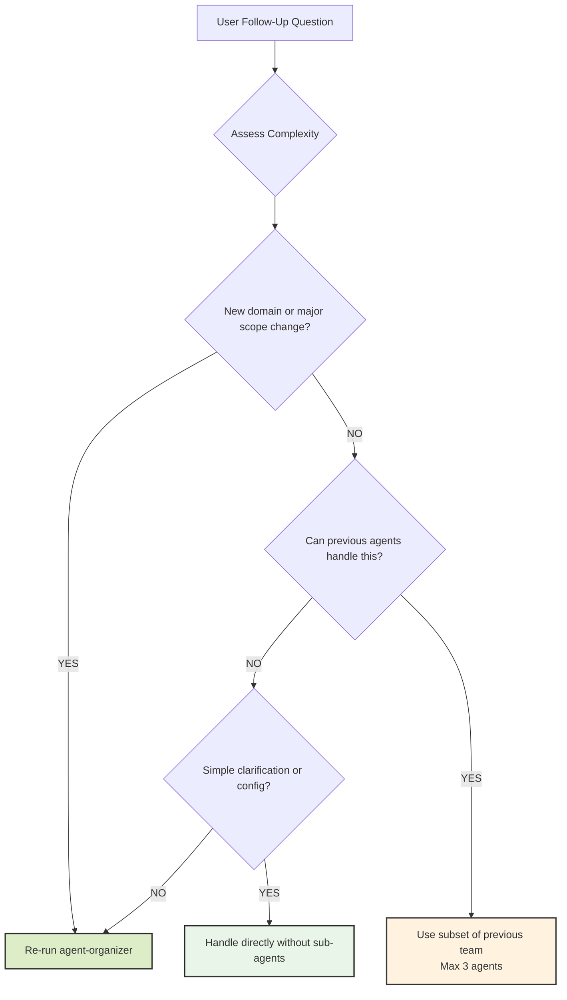

# CLAUDE.md

This file provides guidance to Claude Code (claude.ai/code) when working with code in this repository.

## Development Commands

```bash
# Install dependencies
npm install

# Development server (usually runs on port 3000, may use 3001 if 3000 is busy)
npm run dev

# Build for production
npm run build

# Production server
npm start

# Linting
npm run lint

# Supabase setup (automated)
npm run setup:supabase     # Full guided setup
npm run setup:quick        # Quick setup with defaults
npm run validate           # Validate current setup
```

### Workers Development Commands

```bash
# Navigate to workers directory
cd workers

# Install worker dependencies
npm install

# Development server (localhost:8787)
npm run dev

# Deploy to Cloudflare Workers
npm run deploy

# Run comprehensive test suite
npm run test

# Direct workflow testing (without queue system)
node simple-test.js                    # Test both blueprint and AI systems
node show-workflow-output.js          # Show detailed n8n JSON output
node test-worker-direct.js            # Test worker HTTP endpoints
node test-workflow.js simple-http-test # Test via HTTP with status polling
```

---

# Agent Dispatch Protocol (CRITICAL)

## Philosophy: Delegate, Don't Solve

**Your purpose is delegation, not execution.** You are the central command that receives a request and immediately hands it off to a specialized mission commander (`agent-organizer`).

### Mental Model: The Workflow You Initiate



## Project-Specific Agent Delegation Criteria

**Delegation is MANDATORY for ProcessAudit AI tasks involving:**

### Core Application Changes
- **React Components**: Modifying ProcessInput.jsx, QuestionForm.jsx, AuditReport.jsx, AutomationGenerator.jsx
- **API Routes**: Changes to `/api/analyze-process`, `/api/automations/*`, authentication endpoints
- **Database Schema**: Updates to Supabase tables, RLS policies, or migrations

### Workers & AI System
- **Cloudflare Workers**: Modifications to `/workers/` directory components
- **AI Integration**: Changes to model-router.js, intelligent-prompt-builder.js, or prompt optimization
- **MCP Integration**: Updates to n8n-client.js or node documentation systems
- **Workflow Generation**: Modifications to blueprint or AI-enhanced generation systems

### Architecture & Performance
- **Queue System**: Changes to job tracking, progress polling, or async processing
- **Security**: Updates to secret scanning, policy enforcement, or validation systems
- **Error Handling**: Improvements to fallback systems, retry logic, or error reporting
- **Testing**: Adding new test suites for workers, E2E flows, or validation systems

### Documentation & Configuration
- **Environment Setup**: Changes to .env configurations, deployment scripts, or setup processes
- **Schema Updates**: Database migrations, API documentation, or workflow schemas
- **Deployment**: Modifications to Vercel or Cloudflare Workers deployment processes

## Follow-Up Question Handling Protocol

### Complexity Assessment Framework

- **Simple Follow-ups (Handle Directly):**
  - Configuration questions ("What's the WORKER_URL format?")
  - Single-file clarifications ("What does this function do?")
  - Environment troubleshooting

- **Moderate Follow-ups (Use Previously Identified Agents):**
  - Extending existing automation features
  - UI improvements to existing components
  - Minor worker optimizations

- **Complex Follow-ups (Re-run `agent-organizer`):**
  - New automation types or AI model integration
  - Architecture changes spanning multiple systems
  - Cross-system debugging (Main app ↔ Workers ↔ Database)

### Follow-Up Decision Tree



## Critical Reminders

**ALWAYS:**
- Delegate to `agent-organizer` for any multi-file changes
- Use agent delegation for debugging across systems (Main ↔ Workers ↔ DB)
- Present complete agent-organizer output directly to user

**NEVER:**
- Attempt to solve complex ProcessAudit AI architecture changes alone
- Interfere with agent-organizer's process or sub-agent workflows
- Modify agent-organizer output or add personal commentary

---

## Application Architecture

### Core Application Flow
ProcessAudit AI is a 4-step workflow application that guides users through business process analysis:

1. **Process Input** (`ProcessInput.jsx`) - File upload or manual description
2. **Discovery Questions** (`QuestionForm.jsx`) - AI-generated targeted questions  
3. **AI Analysis** (`AnalysisLoader.jsx`) - Processing with progress indicators
4. **Audit Report** (`AuditReport.jsx`) - Comprehensive results with multiple tabs
   - **NEW**: 5th step available - **n8n Automation Generation** (`AutomationGenerator.jsx`)

### Distributed Architecture (NEW)
The application now uses a **distributed architecture** with two main components:

#### Main Next.js Application
- **Frontend**: React components, pages, and user interface
- **API Routes**: Authentication, basic analysis, job management
- **Database**: Supabase for user data, audit reports, job tracking

#### Cloudflare Workers Backend
- **Location**: `/workers/` directory - completely isolated environment
- **Purpose**: Compute-intensive n8n workflow generation
- **Features**: Queue-based processing, AI model routing, MCP integration
- **Deployment**: Independent Cloudflare Workers deployment

### Access Control System
The application uses a dual-mode access pattern controlled by `pages/index.js`:

- **Landing Page Mode** (default): Shows `LandingPage.jsx` with authentication CTAs and waitlist
- **Application Mode**: Shows `ProcessAuditApp.jsx` when user is authenticated OR has `?access=granted` parameter

Development access routes:
- `?access=granted` - Direct app access
- `/dev-access` - Automatic redirect to `?access=granted`

### AI Integration Architecture (MAJOR UPDATES)
The AI system has been completely redesigned with multiple sophisticated layers:

#### 1. **Multi-Provider AI Model Router** (`workers/src/ai/model-router.js`)
- **Primary**: Claude 3.5 Sonnet API integration (prioritized)
- **Fallback**: OpenAI GPT-4 integration (when Claude unavailable)
- **Tier-based routing**: Orchestrator vs Agent models
- **Token Management**: Optimized for each provider's limits
- **Error Handling**: Graceful fallbacks and retry logic

#### 2. **Intelligent Prompt Builder** (`workers/src/ai/intelligent-prompt-builder.js`)
- **Pattern Analysis**: Analyzes workflow requirements and matches to proven patterns
- **Context-Aware Prompts**: Business context integration (industry, volume, SLA requirements)
- **Working Examples Database**: 15+ proven workflow patterns for email, CRM, data processing
- **Semantic Matching**: Routes similar business problems to successful workflow templates
- **Quality Scoring**: Baseline vs candidate comparison system

#### 3. **MCP (Model Context Protocol) Integration** (`workers/src/mcp/n8n-client.js`)
- **n8n Node Discovery**: Access to 532+ n8n nodes with real-time documentation
- **AI-Enhanced Nodes**: 267 AI-capable nodes for intelligent automation
- **Validation System**: Pre-configured node settings and parameter validation
- **Graceful Fallback**: System works without MCP server (uses built-in knowledge)
- **Server**: Connected to Railway-hosted n8n-MCP server

#### 4. **Dual Generation Strategy** (`workers/src/generators/n8n.js`)
- **Blueprint System**: Fast, deterministic generation for simple workflows (1-2ms)
  - Supports: webhook → http → transform patterns
  - Uses: Pre-built, validated node configurations
- **AI-Enhanced System**: Complex workflow generation with context awareness
  - Email workflows automatically route to AI system
  - Uses intelligent prompt builder + MCP node discovery
  - Incorporates business context and proven patterns

### Data Flow (UPDATED)
1. `ProcessInput` → `/api/generate-questions` → `QuestionForm`
2. `QuestionForm` → `/api/analyze-process` → `AuditReport`
3. **NEW**: `AuditReport` → **Automation Tab** → `/api/automations/create` → **Cloudflare Worker**
4. **Queue Processing**: Worker processes jobs asynchronously with real-time status updates
5. **Download**: `/api/automations/download/[jobId]` → Complete n8n workflow JSON
6. File processing handled by `/api/process-file` and `utils/fileProcessor.js`

### Authentication System
Supabase-based authentication with graceful degradation:
- `contexts/AuthContext.js` provides authentication state
- `hooks/useSupabase.js` handles database operations
- App functions fully without authentication (shows landing page)
- Database operations only work when Supabase is configured
- **NEW**: Service role authentication for worker database access

## Key Configuration

### Environment Variables (SIGNIFICANTLY UPDATED)

#### Main Application (.env.local)
```bash
# AI Integration
CLAUDE_API_KEY=sk-ant-your_key_here              # Primary AI provider
OPENAI_API_KEY=sk-your_openai_key                # Fallback AI provider

# Supabase Configuration  
NEXT_PUBLIC_SUPABASE_URL=https://your-project.supabase.co
NEXT_PUBLIC_SUPABASE_ANON_KEY=your_anon_key
SUPABASE_SERVICE_KEY=your_service_role_key       # For worker access

# Workers Integration (NEW)
CLOUDFLARE_WORKER_URL=https://your-worker.workers.dev  # Production worker URL
NEXT_PUBLIC_APP_URL=https://your-app.vercel.app  # For CORS configuration
```

#### Workers (.dev.vars for local, wrangler secrets for production)
```bash
# AI Configuration
CLAUDE_API_KEY=sk-ant-your_key_here              # Primary AI for workflow generation
OPENAI_API_KEY=sk-your_openai_key                # Fallback AI provider

# Database Access
SUPABASE_URL=https://your-project.supabase.co
SUPABASE_SERVICE_KEY=your_service_role_key       # Full database access

# MCP Integration (NEW)
N8N_MCP_SERVER_URL=https://czlonkowskin8n-mcp-railwaylatest-production-a820.up.railway.app
N8N_MCP_AUTH_TOKEN=your_mcp_auth_token           # Access to n8n node documentation

# Optional Features
INCLUDE_WEBHOOK_AUTH_PLACEHOLDER=true            # Add webhook auth placeholders
OPENAI_ORCHESTRATOR_MODEL=gpt-4                  # Override model selection
OPENAI_AGENT_MODEL=gpt-4                         # Override agent model
```

### Database Schema (MAJOR ADDITIONS)

#### Existing Tables
- Main schema: `database/schema.sql` (audit reports, saved reports, user profiles)
- Waitlist schema: `database/waitlist-schema.sql` (landing page email collection)

#### NEW Tables (Added for Workers Integration)
```sql
-- Job Tracking System
CREATE TABLE automation_jobs (
  id UUID PRIMARY KEY DEFAULT gen_random_uuid(),
  user_id UUID REFERENCES auth.users(id),
  status TEXT NOT NULL CHECK (status IN ('pending', 'processing', 'completed', 'failed')),
  job_type TEXT NOT NULL DEFAULT 'n8n',
  progress INTEGER DEFAULT 0,
  orchestration_plan JSONB NOT NULL,
  result JSONB,
  error_message TEXT,
  created_at TIMESTAMP WITH TIME ZONE DEFAULT NOW(),
  updated_at TIMESTAMP WITH TIME ZONE DEFAULT NOW()
);

-- Generated Automation Storage
CREATE TABLE generated_automations (
  id UUID PRIMARY KEY DEFAULT gen_random_uuid(),
  user_id UUID REFERENCES auth.users(id),
  job_id UUID REFERENCES automation_jobs(id),
  automation_type TEXT NOT NULL DEFAULT 'n8n',
  workflow_data JSONB NOT NULL,
  metadata JSONB DEFAULT '{}',
  created_at TIMESTAMP WITH TIME ZONE DEFAULT NOW()
);

-- Performance indexes and RLS policies included
```

### AI Prompt Structure (COMPLETELY REDESIGNED)
The AI prompt system has been rebuilt with multiple specialized components:

#### Main Application Prompts (`utils/aiPrompts.js`)
- `QUESTION_GENERATION_PROMPT` - Generates 6-8 discovery questions with follow-up triggers
- `PROCESS_ANALYSIS_PROMPT` - Comprehensive analysis with ROI calculations and implementation roadmaps
- `DYNAMIC_FOLLOWUP_PROMPT` - Context-aware follow-up question generation

#### Workers AI System (`workers/src/ai/` and `workers/src/prompts.js`)
- **Orchestrator Prompt**: Converts business requirements into n8n orchestration plans
- **Constrained Orchestrator**: Optimized version for simple workflows
- **Intelligent Prompt Builder**: Context-aware prompts with working examples and pattern analysis
- **Token-Optimized**: All prompts designed for specific model context limits

The AI responses follow specific JSON structures that map to component expectations:
- Questions: Array with `id`, `question`, `type`, `options`, `followUpTriggers`
- Analysis: Object with `executiveSummary`, `automationOpportunities`, `roadmap`, `implementationGuidance`
- **NEW**: n8n workflows: Complete workflow JSON with nodes, connections, metadata

## Component Architecture

### Main Application Components
- `ProcessAuditApp.jsx` - Main app container with step management
- `StepIndicator.jsx` - Progress visualization component
- `UserMenu.jsx` - Authentication status and user actions

### Form Components
- `ProcessInput.jsx` - File drag-drop and text input with validation
- `QuestionForm.jsx` - Dynamic form generation from AI-generated questions
- `AnalysisLoader.jsx` - Progress indicator with simulated analysis steps

### Report Components  
- `AuditReport.jsx` - Multi-tab report display (Overview, Opportunities, Implementation, Guidance)
- `SavedReportsModal.jsx` - Report management and retrieval

### NEW: Automation Components
- **`AutomationGenerator.jsx`** - Real-time n8n workflow generation with progress tracking
- **`AutomationTemplates.jsx`** - Template-based workflow generation interface
- **Progress System**: Real-time polling from 0% → 100% with status updates

### Authentication Components
- `AuthModal.jsx` - Sign in/sign up modal with form validation
- `LandingPage.jsx` - Marketing page with authentication CTAs and waitlist

### NEW: Job Management System (`utils/jobStore.js`)
- **In-Memory Fallback**: Job tracking when Supabase unavailable
- **Progress Updates**: Real-time status synchronization
- **Error Handling**: Comprehensive error state management

## File Processing

The app supports multiple file formats via `utils/fileProcessor.js`:
- PDF, DOC, DOCX, TXT files
- Text extraction and content preprocessing
- File size validation and error handling

## Deployment (MAJOR CHANGES)

### Dual Deployment Architecture
The application now requires **two separate deployments**:

#### 1. Main Application (Vercel)
- `vercel.json` configures API function timeouts (30s for AI processing)
- All API endpoints have extended timeout for AI operations
- Auto-deployment from main branch
- Environment variables configured in Vercel dashboard

#### 2. Workers Backend (Cloudflare Workers)
```bash
# Deploy to production
cd workers
npm run deploy

# Set production secrets
npx wrangler secret put CLAUDE_API_KEY
npx wrangler secret put SUPABASE_SERVICE_KEY
npx wrangler secret put N8N_MCP_AUTH_TOKEN
```

### Script Utilities
- `scripts/setup-supabase.sh` - Interactive Supabase setup
- `scripts/quick-supabase.sh` - Automated setup with defaults
- `scripts/validate-setup.sh` - Environment validation
- `scripts/apply-schema.sh` - Database schema application

### NEW: Deployment Checklist
See `DEPLOYMENT_CHECKLIST.md` for comprehensive production deployment guide including:
- Environment variable configuration
- Database migration steps
- Secret management
- Health check verification
- Performance monitoring setup

## Testing Infrastructure (COMPLETELY NEW)

### Workers Testing (Comprehensive Test Suite)
```bash
cd workers

# Run all tests
npm run test

# Individual test files
npm run test orchestrator.spec.js    # Orchestration logic testing
npm run test validator.spec.js       # Workflow validation testing
npm run test security.spec.js        # Security policy enforcement
npm run test policy-http-email.spec.js # Policy compliance testing
npm run test baseline-candidate.spec.js # Quality scoring system
```

**Test Coverage:**
- **Orchestrator Testing**: Business plan → n8n orchestration conversion
- **Validation Testing**: Workflow schema compliance and auto-repair
- **Security Testing**: Secret scanning, policy enforcement
- **Quality Testing**: Baseline vs candidate scoring with fixtures
- **E2E Worker Testing**: Direct workflow generation testing

### Main Application Testing
```bash
# E2E automation flow testing
npx playwright test tests/e2e-automation-flow.spec.js

# This tests the complete user journey:
# Login → Process Input → Questions → Analysis → n8n Generation → Download
```

### Direct Testing Tools (NEW)
```bash
cd workers

# Test workflow generation directly (fastest)
node simple-test.js

# Show detailed workflow JSON output  
node show-workflow-output.js

# Test worker HTTP endpoints
node test-worker-direct.js

# Test via HTTP with status polling
node test-workflow.js simple-http-test --production
```

## Important Implementation Notes

### AGENT-FIRST DEVELOPMENT POLICY (CRITICAL)
**⚠️ MANDATORY: All complex ProcessAudit AI tasks MUST use the Agent Dispatch Protocol:**

- **ALWAYS DELEGATE**: Use `agent-organizer` for any multi-file changes, architecture modifications, or cross-system debugging
- **PROJECT COMPLEXITY**: ProcessAudit AI's distributed architecture (Main App ↔ Workers ↔ Database ↔ AI Systems) requires specialized expertise
- **QUALITY ASSURANCE**: Agent teams provide comprehensive testing, validation, and documentation
- **CONSISTENCY**: Ensures all changes follow established patterns across React components, API routes, Workers, and database schemas

**⚠️ NEVER attempt these tasks without agent delegation:**
- Modifying AI integration (model-router.js, intelligent-prompt-builder.js)
- Changes spanning Main App + Workers systems
- Database schema updates affecting multiple tables
- Worker queue system modifications
- Complex debugging across distributed components

### NO FALLBACK DATA POLICY (CRITICAL)
**⚠️ IMPORTANT: This application follows a strict NO FALLBACK DATA policy for better debugging:**

- **NO MOCK/SAMPLE DATA**: Never use fallback sample data or mock processing
- **EXPLICIT ERRORS ONLY**: All missing dependencies must return explicit error messages
- **Required Dependencies**: 
  - `CLOUDFLARE_WORKER_URL` - Required for automation generation
  - `NEXT_PUBLIC_SUPABASE_URL` + `SUPABASE_SERVICE_ROLE_KEY` - Required for job tracking
  - `CLAUDE_API_KEY` or `OPENAI_API_KEY` - Required for AI workflow generation
- **Error Message Format**:
  ```javascript
  {
    error: 'Descriptive error name',
    details: 'Detailed explanation of what is missing and why',
    missing: { /* Specific missing configuration */ }
  }
  ```
- **Reasoning**: Fallback data makes debugging very hard by masking real configuration issues
- **Test Data Exception**: Mock data is only acceptable in explicit test files or when `NODE_ENV=test`

### Error Handling Patterns (ENHANCED)
- **Multi-Layer Validation**: Schema validation, security scanning, policy enforcement
- **Auto-Repair System**: Automatic fixing of common workflow issues
- **Graceful Degradation**: AI model fallback (Claude → OpenAI) but NO data fallbacks
- **Queue Resilience**: Retry logic with exponential backoff
- **Explicit Configuration Requirements**: All services require proper environment variables
- Authentication operations gracefully handle missing Supabase configuration with clear errors
- File upload includes validation and user-friendly error messages

### State Management
- Global authentication state via React Context (`AuthContext`)
- Component-level state for multi-step workflow
- **NEW**: Queue-based state management for long-running operations
- **NEW**: Real-time progress tracking with polling
- No external state management library used

### Security Enhancements (NEW)
- **Secret Scanning**: Prevents hardcoded credentials in workflows
- **Policy Enforcement**: HTTP retry requirements, email field validation
- **Row-Level Security**: Multi-tenant data isolation
- **CORS Configuration**: Environment-specific origin restrictions
- **Input Validation**: Multiple validation layers throughout the system

### Performance Optimizations (NEW)
- **Blueprint vs AI Routing**: Simple workflows use fast blueprint generation (1-2ms)
- **Token Optimization**: Targeted documentation retrieval reduces context usage
- **Caching Systems**: MCP client caching, pattern analysis caching
- **Queue Processing**: Background processing prevents UI blocking
- **Progressive Enhancement**: Immediate UI feedback with background processing

### Styling System
- Tailwind CSS with custom gradient backgrounds
- Component-specific CSS classes in `styles/globals.css`
- Responsive design with mobile-first approach
- Custom color variables: `--primary`, `--secondary`, `--success`, `--warning`

### Token Limit Management (ENHANCED)
All AI prompts are optimized for their target models:
- **Claude 3.5 Sonnet**: 200k context, 8192 output tokens
- **GPT-4**: 128k context, 4096 output tokens
- **Intelligent Routing**: Selects appropriate model based on task complexity
- **Context Optimization**: Uses targeted documentation retrieval and pattern matching to minimize token usage

## Development Workflow (NEW)

### Agent-First Development Process

**For ALL complex tasks, follow this workflow:**

1. **Triage Request**: Assess if task requires agent delegation (see Agent Dispatch Protocol above)
2. **Delegate to agent-organizer**: Let specialized agents handle multi-system changes
3. **Validate Results**: Ensure output meets ProcessAudit AI quality standards
4. **Deploy**: Follow standard deployment process for both systems

### Full-Stack Development Standards

When working on ProcessAudit AI (either directly for simple tasks or through agents for complex ones):

#### Planning & Staging
- Break work into 3-5 cross-stack stages (Frontend → API → Workers → Database)
- Document in `IMPLEMENTATION_PLAN.md` (agents will create this automatically)
- Update status after each merge, delete plan file after production verification

#### Implementation Flow
- **Understand**: Identify existing patterns for UI (React), API (Next.js), Workers (Cloudflare), DB (Supabase)  
- **Test First**: Write integration tests for API routes, component tests for React, worker tests for CF Workers
- **Implement Minimal**: Just enough code to pass all tests
- **Refactor Safely**: Clean code with 60%+ test coverage for changed areas
- **Commit Clearly**: Reference plan stage, include scope (frontend, backend, workers, DB)

#### Quality Gates
- Tests pass at all levels (unit, integration, E2E)
- Code meets project style guides (ESLint, Prettier)
- No console errors or warnings
- No unhandled API errors in the UI
- Workers pass security validation
- Database changes include proper RLS policies

### Local Development Setup
1. **Main App**: `npm run dev` (port 3000/3001)
2. **Workers**: `cd workers && npm run dev` (port 8787)  
3. **Database**: Supabase local development or cloud
4. **Testing**: Both environments support direct testing

### Production Deployment
1. **Deploy Workers First**: `cd workers && npm run deploy`
2. **Configure Secrets**: Use wrangler CLI for sensitive environment variables
3. **Deploy Main App**: Vercel auto-deployment with environment variables
4. **Verify Health**: Use health check endpoints to confirm deployment

### Debugging Tools
- **Worker Logs**: Real-time logs via `wrangler tail`
- **Health Endpoints**: `/health`, `/test-mcp` for system status
- **Direct Testing**: Bypass UI for faster debugging
- **Progress Tracking**: Real-time job status monitoring

This represents a significant architectural evolution from a simple Next.js app to a distributed, production-ready system with advanced AI capabilities, comprehensive testing, and enterprise-grade reliability features.